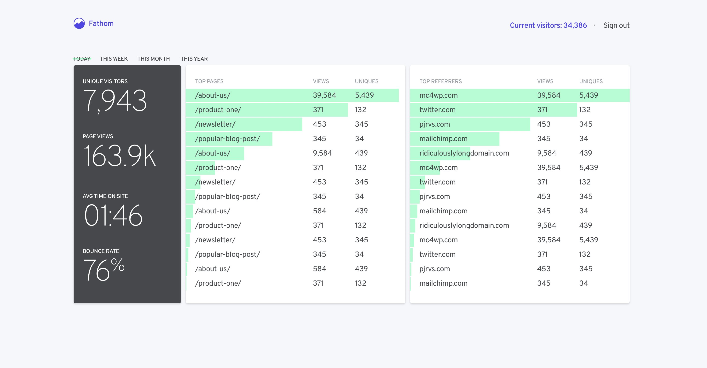

<!--
NB: Deze README is automatisch gegenereerd door <https://github.com/YunoHost/apps/tree/master/tools/readme_generator>
Hij mag NIET handmatig aangepast worden.
-->

# Fathom voor Yunohost

[](https://ci-apps.yunohost.org/ci/apps/fathom/)


[](https://install-app.yunohost.org/?app=fathom)

*[Deze README in een andere taal lezen.](./ALL_README.md)*

> *Met dit pakket kun je Fathom snel en eenvoudig op een YunoHost-server installeren.*  
> *Als je nog geen YunoHost hebt, lees dan [de installatiehandleiding](https://yunohost.org/install), om te zien hoe je 'm installeert.*

## Overzicht

Fathom Analytics is quick and easy to set up with any website, CMS or programming framework.

**Geleverde versie:** 1.3.1~ynh1

**Demo:** <https://app.usefathom.com/demo>

## Schermafdrukken



## Documentatie en bronnen

- Officiele website van de app: <https://usefathom.com/>
- Officiele gebruikersdocumentatie: <https://usefathom.com/features/how-fathom-analytics-works>
- Upstream app codedepot: <https://github.com/usefathom/fathom>
- YunoHost-store: <https://apps.yunohost.org/app/fathom>
- Meld een bug: <https://github.com/YunoHost-Apps/fathom_ynh/issues>

## Ontwikkelaarsinformatie

Stuur je pull request alsjeblieft naar de [`testing`-branch](https://github.com/YunoHost-Apps/fathom_ynh/tree/testing).

Om de `testing`-branch uit te proberen, ga als volgt te werk:

```bash
sudo yunohost app install https://github.com/YunoHost-Apps/fathom_ynh/tree/testing --debug
of
sudo yunohost app upgrade fathom -u https://github.com/YunoHost-Apps/fathom_ynh/tree/testing --debug
```

**Verdere informatie over app-packaging:** <https://yunohost.org/packaging_apps>
